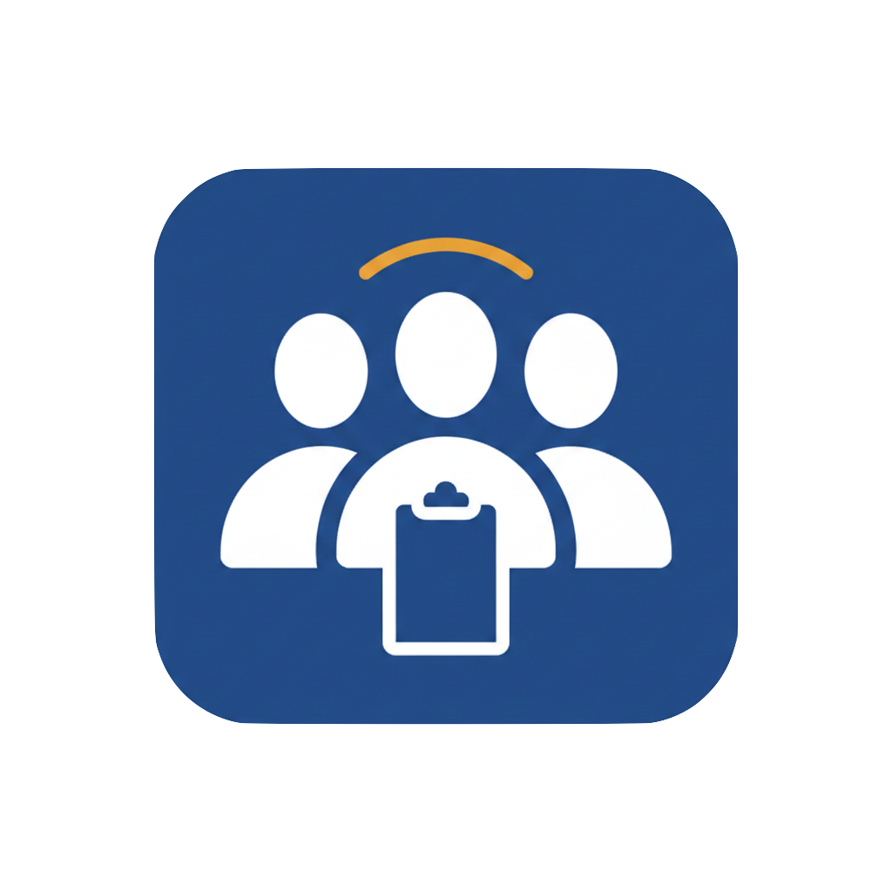

  

<h1 align="center">User Guide</h1>

  A quick walkthrough of the Teams Management platform and its features.

---

## Getting Started

### Sign Up / Sign In

You can create an account using your email and password, or sign in instantly with your Google account. After signing in, you'll land on the home page with published assignments from all students.

  
   <em>Landing page</em>

---

## Home Page

The home page displays all published assignments across departments. Use the **subject filter pills** at the top to narrow down by subject: Computer Science, Physics, Math, or Chemistry.

Each assignment card shows:
- Assignment title and description preview
- Subject badge (color-coded)
- Author name and department

Click any assignment to view its full details, or click an author's name to visit their profile.

  
   <em>Home page — browsing published assignments</em>

---

## Assignments

### My Assignments

Navigate to **My Assignments** from the header to see assignments you've posted. You can filter them by status: Published, In Process, or Completed.

Click **+ New Assignment** to create one. Fill in the title, description, subject, and optional due date.

  
   <em>My Assignments — filtered by status</em>

### Assignment Details

Each assignment page shows the full description, subject and status badges, author info, and due date. As the owner, you can:
- **Change the status** between Published, In Process, and Completed
- **View and manage join requests** from other students
- **Delete** the assignment

  
   <em>Assignment detail — owner view with status controls and join requests</em>

### Requesting to Join

When viewing someone else's published assignment, click **Request to Join Assignment**. The assignment owner will receive a notification and can accept or decline your request from the assignment page.

Your request status is shown on the assignment:
- **Request Sent** — waiting for the owner's response
- **Request Accepted** — you've been added to the team
- **Request Declined** — the owner declined your request

  
   <em>Requesting to join an assignment</em>

---

## Teams

Navigate to **Teams** from the header to see all teams you belong to. Each team card shows:
- Assignment title and subject
- Due date countdown
- Team owner (highlighted with an amber badge)
- Member avatars
- **Chat** button to open the team group chat

  
   <em>My Teams — overview of all your teams</em>

---

## Messaging

### Messages Overview

Click the **envelope icon** in the header to open Messages. The left panel lists all your conversations — both direct messages and team group chats. A red badge on the header icon shows your unread message count.

  
   <em>Messages — conversation list with DMs and team chats</em>

### Direct Messages

Click on a user's name in the conversation list (or visit their profile and click **Send Message**) to open a direct conversation. Features include:

- **Real-time messaging** — messages appear instantly without page refresh
- **Read receipts** — blue double checkmarks appear when your message has been read
- **Typing indicators** — animated dots show when the other person is typing

  
   <em>Direct message — real-time chat with read receipts</em>

### Team Group Chat

Open a team's group chat by clicking the **Chat** button on any team card, or by selecting the team from the conversations list in Messages. Group chats work like direct messages with a few differences:

- All team members can see and send messages
- Each message shows the **sender's name** for clarity
- The header displays all team member avatars
- Typing indicators show which member is typing

  
   <em>Team group chat — real-time messaging with all team members</em>

---

## Profiles

### Viewing Profiles

Click on any user's avatar or name throughout the app to visit their profile. Profiles display:
- Name and avatar with a color-coded department banner
- Bio
- Email address
- Department badge
- **Send Message** button to start a direct conversation

  
   <em>User profile with department banner</em>

### Editing Your Profile

Access your profile settings from the **user dropdown** in the top-right corner of the header. Click your avatar, then select **Edit Profile** to update your name, bio, department, and password.

  
   <em>User dropdown — quick access to profile and settings</em>

---

## Notifications

Real-time notifications appear as toast messages in the top-right corner when:
- Someone sends you a **direct message** while you're on another page
- A **team member** sends a message in your group chat
- Someone sends you a **join request** for your assignment

Click on a notification to navigate directly to the relevant conversation.

  
   <em>Real-time notification for an incoming message</em>

